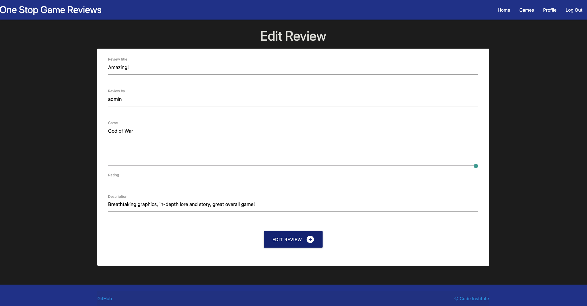
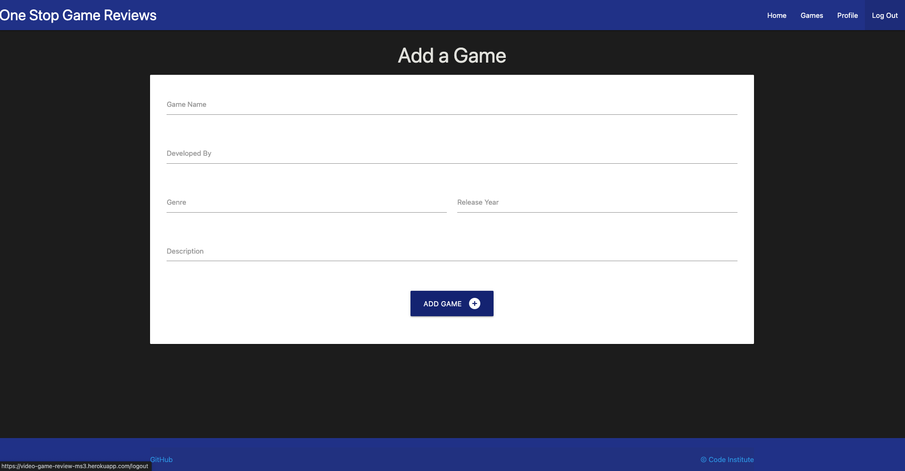
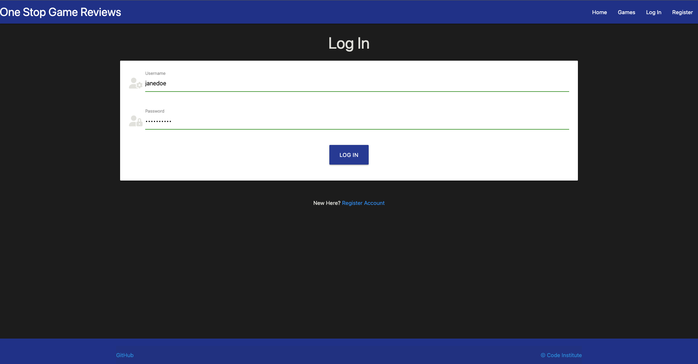
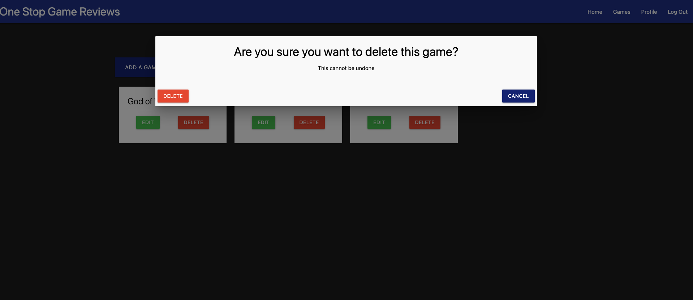

# One Stop Game Reviews

One Stop Game Reviews is a website designed to allow users to add reviews and rate the video games they have played.
A deployed link is available [here.](https://video-game-review-ms3.herokuapp.com/)

## Showcase of the site


## UX

## Goals

The aim of the website is to allow the users to write reviews on their opinions of the game and rate it out of 5. Games are managed by the 'admin'.

### User:

As a user;

* I want to understand the context of the website and what it has to offer.
* I want to be able to register an account with the website to keep track of the reviews I have posted.
* I want to easily log into my already registered account.
* I want to easily log out of the account I am logged into, and be notified that I have successfully been logged out.
* I would like to access the site easily on a mobile phone or tablet.
* I want to be able to check if there are any additional games that have been added.
* I would like to be able to edit the reviews I have created.
* I would like to be able to delete the reviews I have created.
* I would like defensive programming to be in effect if I was to attempt to delete a review.
* I would like the privilage of only the author of the review to be able to edit their own review.

### Admin:

As a admin;

* I would like to add and manage games that users are able to create a review for.
* I would like to be able to visually be able to see what users have rated the games, using star icons.
* I would like the ability to delete any review for any reason deemed neccessary.
* I would want the deletion of a game to delete any reviews that is associated with said game.
* I would like defensive programming to be in effect if I was to attempt to delete a game.

## Structure

### Logo and Navigation bar

* The name of the website, One Stop Game Reviews, is located on the top left of the webpage, along with the ability to return to the review page just by clicking on the logo.
* The navigation links are located on the top right of the webpage, which links to the other available pages. Here users can easily use these links to navigate from each webpage.
* For smaller devices, the navigation bar changes to a burger menu for a more responsive design for mobile or tablet users, this allows for a compact and user-friendly design. 


### Header

* The header cotains text displaying which page you are currently on.


### Footer

* The footer contains external links to both Github and The Code Institute.


### Review Page

* The review page is the very first page the user lands on, as stated by the header. Here the user can see the reviews left by other users, seeing their rating, who the created the review and the reviews description.
* Above the reviews is a button that reads "Add a review". If the user is not logged into an account, it will flash a message, stating that the user needs to be logged in first before creating a review. If the user is logged in, this button takes them to the "Add Review" page.


### Add review page

* The add review page is access by one, being logged into an account and two, interacting with the "add review" button on the review page.
* The add review page consists of a form that has 5 input fields; the reviews title, reviews creator, the games name, the review rating amd finally the reviews description.
- The users username has already prefilled the "Review by" input field and is set to read only.
- All input fields (with the exception of the "review by" field) are required to submit the form, this is highlighted by the change of text color to red.
* Once the form has been filled in, the user can click the "Add Review" button, which will create a review and send the user back to the reviews page.


### Edit review page

* Similar to the "Add review" page, the edit page has the same form as the add page. The difference is that the Game name input field is now sent to read only, therefore you cannot change which game you are reviewing.
* Once the review has been edited, the user can click the edit review button, this edits the database and changes whatever the user edited. This also sends the user back to the reviews page.
* For defensive programming, only the user that created the review (the author) can edit the review.



### Games page

* The game page is where the user is able to browse the games the admin has published.
* Each game has its own card with its title and a image of the game.
- A icon (two chevrons pointing up ) can be clicked, which reveals more information about the game.
- For the admin, There is a edit button and a delete button underneath the title of the game.
* Above the game cards is a button to add a game.


### Add game page

* The add game page is similar to the add reviews page, but only the admin can access this page.
* Each input field is required as shown by the change of the text color to red.
* The add game button at the bottom of the form publishes the game in the format of a card to the games page.



### Edit game page

* The edit game page is the same as the add game page and as before, only the admin can access this page.
* All input fields are able to be edited and changed.
* Once finished, and the Edit game button is clicked on, It sends the admin back to the games page and changes the games details.


### Profile page

* The profile page has all of the reviews that the current user has created.
* The header for the page changes, depending on who is logged in.
- Along with the pages header, the reviews shown will also change as stated above.
* Here the user can also edit/delete their reviews.


### Log in page

* The log in page contains the relevant header along with a form.
- The forms input fields are simply username and password with relevant icons.
* Underneath the form is some text asking if the user is new to the site and asks if the user would like to register an account.
- The 'Register account' text is a link to the register page.



### Register page

* The register page has the same input fields as the log in page, but with slightly different icons, to show its a registration form.
* The way this form works, it will not allow two of the same usernames, if a user trys to register with a username that has already been used, it will tell the user with a pop up.
* Similar to the log in page, below the form is some text that has a link that directs exsisting users to the log in page.


### Deletion modals

* The deletion modals are used as a form of defensive programming, clicking any delete button, whether its a review of a game, will cause the modal to appear, asking if the user would like to continue.
* The user has two buttons within this modal;
- Delete - clicking this button will delete the game or review in question.
- Cancel - clicking this button will close the modal and redirect the user to the relevant page.




## Design

### Images

The images used throughout the website are relivant to each game.
* The images are Game covers used on physical copies of the game.

### Colour scheme

* The colors of indigo and black used throughout help contrast the white text.
* The two colors also help ease the users eyes. It reduces the light emitted by device screens while maintaining the minimum colour contrast ratios required for accessability.

### Fonts 

As [Materialize](https://materializecss.com/) is used for CSS. Their default font is Roboto 2.0, which is whats used throughout the site.

## Wireframes

The wireframes for the webpage can be viewed here.

* 

* 

* 

* 

* 

* 

* 

## ERD diagram

The ERD diagram for the project can be viewed here.

* 

  - The User(including admin) and Games tables are within the Postgres database.

  - The Reviews table is within the non relational database of mongoDB.
  
  - The Reviews table has a relational connection to the Games table through the use of the game id from Postgres, as seen below.

    

## Languages

* [HTML5](https://en.wikipedia.org/wiki/HTML5)
* [CSS](https://en.wikipedia.org/wiki/CSS)
* [JavaScript](https://en.wikipedia.org/wiki/JavaScript)
* [Python](https://en.wikipedia.org/wiki/Python_(programming_language))

## Tools

* [Gitpod](https://www.gitpod.io/) - Used as a cloud-based IDE.
* [Github](https://github.com/) - Used to secure code online.
* [Git](https://git-scm.com/) - Version control.
* [Balsamiq](https://balsamiq.com/) - Used to create wireframes.
* [Font Awesome](https://fontawesome.com/icons) - For the various icons used.
* Google Chrome Dev tools - for proofreading code.
* [Am I Responsive?](http://ami.responsivedesign.is/) - To see the responsiveness of the website on multiple devices.
* [WebAIM](https://webaim.org/resources/contrastchecker/#:~:text=WCAG%202.0%20level%20AA%20requires,such%20as%20form%20input%20borders) - Used to check the contrast between foreground and background colours.
* [pep8online](http://pep8online.com/) - Used to make sure my code meets the satisfactory PEP8 compliance.
* [MongoDB](https://www.mongodb.com/) - Used for the NoSQL database.

## Testing

To view all testing documentation click [here](TESTING.md)

## Deployment

The live deployed application can be found at [video-game-review-ms3](https://video-game-review-ms3.herokuapp.com/).

### Heroku

This project uses [Heroku](https://www.heroku.com), a platform as a service (PaaS) that enables developers to build, run, and operate applications entirely in the cloud.

Deployment steps are as follows, after account setup:

- Select *New* in the top-right corner of your Heroku Dashboard, and select *Create new app* from the dropdown menu.
- Your app name must be unique, and then choose a region closest to you (EU or USA), and finally, select *Create App*.
- From the new app *Settings*, click *Reveal Config Vars*, and set the following key/value pairs:
  - `IP` 0.0.0.0
  - `PORT` 5000
  - `MONGO_URI` (insert your own MongoDB URI key here). To get the `MONGO_URI`, follow the steps outlined below.

### MongoDB

You will need to sign-up for a [MongoDB](https://www.mongodb.com/) account.

The name of the database on Mongo should be called **video_game_review**.

The only collection needed for this project is called **reviews**.

Click on the cluster created for the project.

Click on the _Connect_ button.

Click _Connect Your Application_.

Copy the connection string and ensure to replace `<password>` with your own password.

Paste this string into the env.py file and also Heroku config var as the value for the `MONGO_URI` key.

  - `MONGO_DBNAME` (insert your own MongoDB DB Name key here). The `MONGO_DBNAME` is the name given to the database created within the cluster on the MongoDB website as shown in the screenshot below.

  - `DATABASE_URL` (this comes from the _Resources_ tab, you can get your own Postgres Database using the Free Hobby Tier)
    - Click on the _Resources_ tab.
    - Search for Postgres in the 'Add-ons' search bar.
    - Select Heroku Postgres as shown in the screenshot below.

  - `SECRET_KEY` (this can be any random secret key)

Heroku needs two additional files in order to deploy properly.
- requirements.txt
- Procfile

You can install this project's requirements (where applicable) using: `pip3 install -r requirements.txt`. If you have your own packages that have been installed, then the requirements file needs updated using: `pip3 freeze --local > requirements.txt`

The Procfile can be created with the following command: `echo web: python run.py > Procfile`

For Heroku deployment, follow these steps to connect your GitHub repository to the newly created app:

Either:
- Connect Heroku and GitHub.
- Then select "Automatic Deployment" from the Heroku app.
- Click the _Deploy Branch_ button.

Or:
- In the Terminal/CLI, connect to Heroku using this command: `heroku login -i`
- Set the remote for Heroku: `heroku git:remote -a <app_name>` (replace app_name with your app, without the angle-brackets)
- After performing the standard Git `add`, `commit`, and `push` to GitHub, you can now type: `git push heroku main`

The frontend terminal should now be connected and deployed to Heroku.

### Local Deployment

*Gitpod* IDE was used to write the code for this project.

To make a local copy of this repository, you can clone the project by typing the follow into your IDE terminal:
- `git clone https://github.com/joshfreeman00/video-game-review-MS3.git`

You can install this project's requirements (where applicable) using: `pip3 install -r requirements.txt`.

Create an `env.py` file, and add the following environment variables:

```python
import os

os.environ.setdefault("IP", "0.0.0.0")
os.environ.setdefault("PORT", "5000")
os.environ.setdefault("MONGO_URI", "insert your own MongoDB URI key here")
os.environ.setdefault("MONGO_DBNAME", "insert your own MongoDB DB Name key here")
os.environ.setdefault("DB_URL", "your local Postgres database")
os.environ.setdefault("DATABASE_URL", "from your Hobby Tier on the Resources tab from Heroku")
os.environ.setdefault("SECRET_KEY", "this can be any random secret key")
os.environ.setdefault("DEVELOPMENT", "set to True in local environment, but False on deployment")
```

Alternatively, if using Gitpod, you can click below to create your own workspace using this repository.

[](https://gitpod.io/#https://github.com/joshfreeman00/video-game-review-MS3)

## Credits

* [Font Awesome](https://fontawesome.com/icons) - The icons used.
* [Materialize](https://materializecss.com/) - For CSS formatting and styling.
* [Stack Overflow](https://stackoverflow.com/) - For help debugging and fixes throughout.
* My mentor - For helpful tips and debugging.
* Task Manager Walkthrough project - The code for user registration and log in was used from Code Institute.
* [Wikipedia](*) - For the images used for the games.


## Acknowledgements

* To create this website, I used material and information covered in the Full Stack Development course by Code Institute. As well as information from the gitSlack Community Channels, Stack Overflow and W3Schools.

* Tim Nelson, my mentor, for reviewing my work and providing useful, help, feedback and advice throughout.