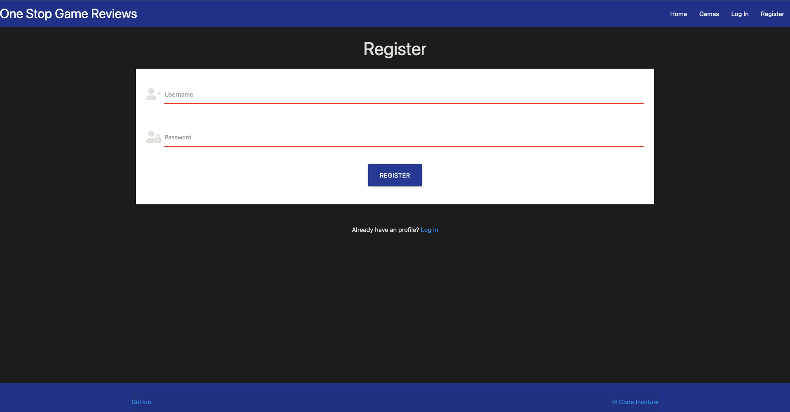
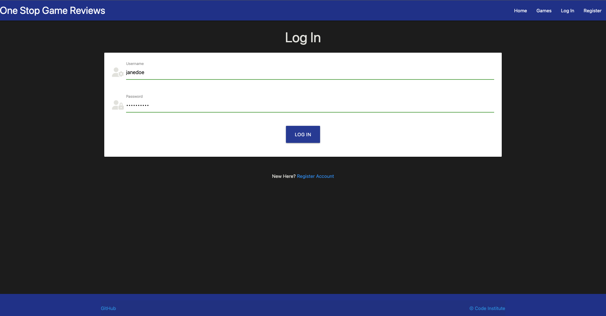
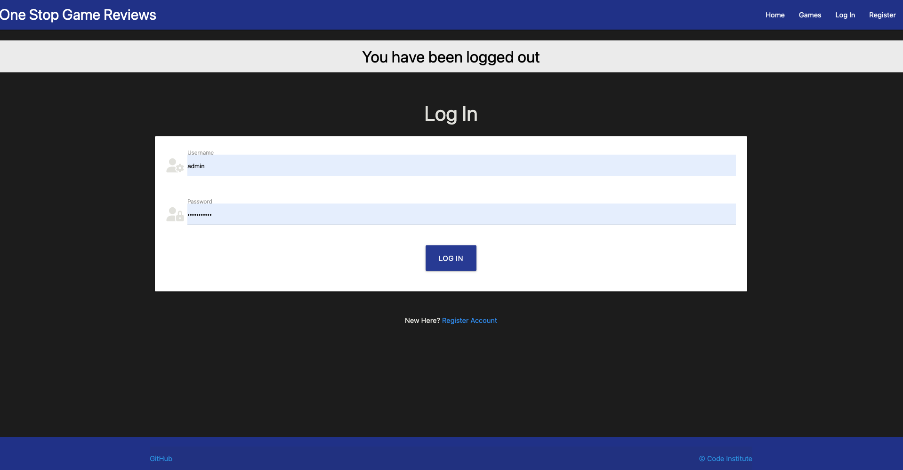
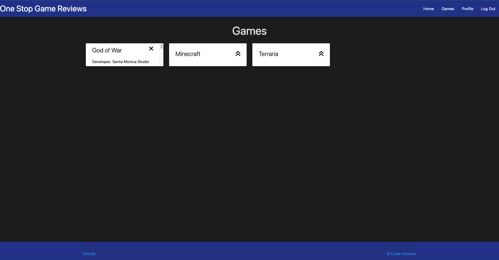
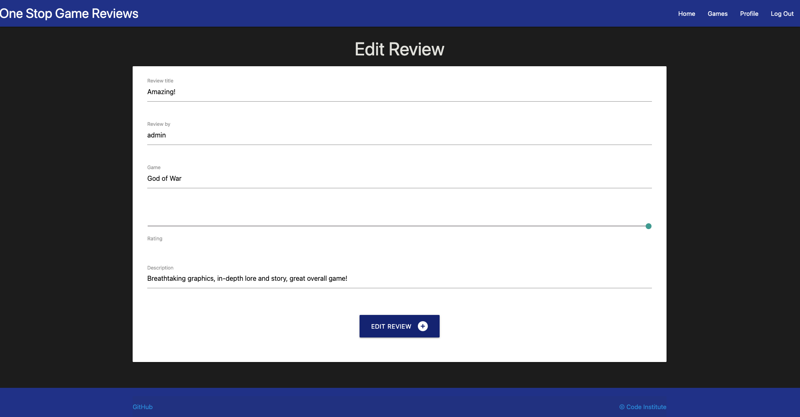
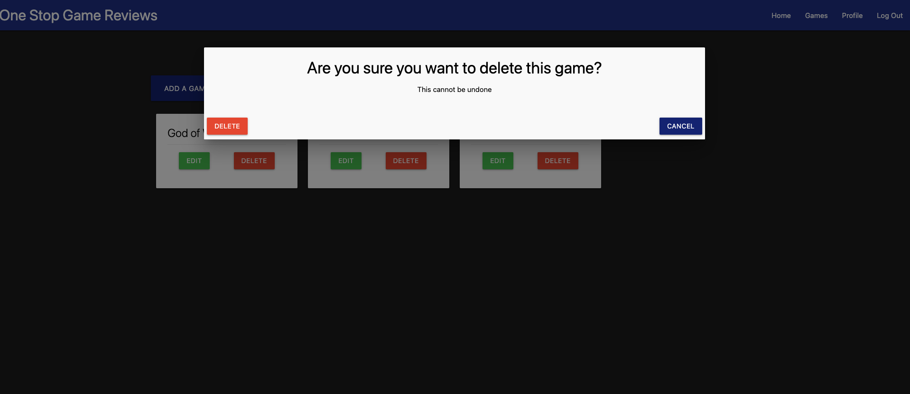
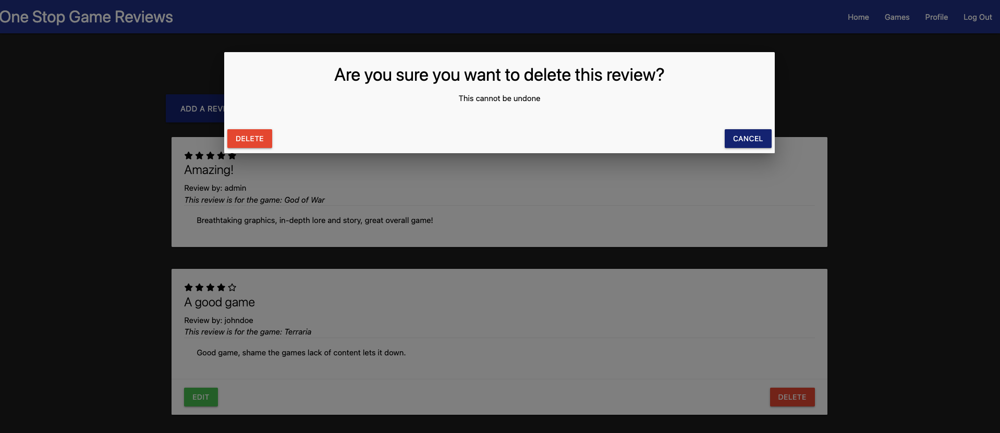
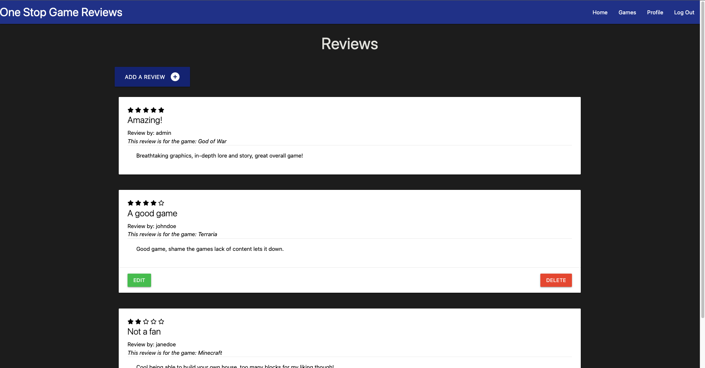
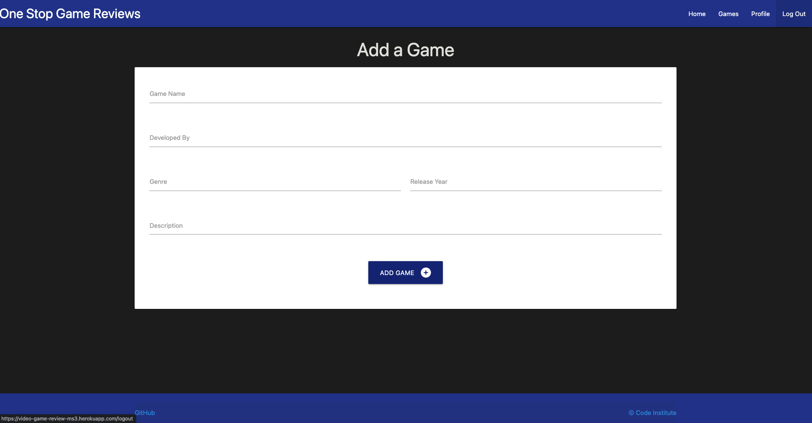
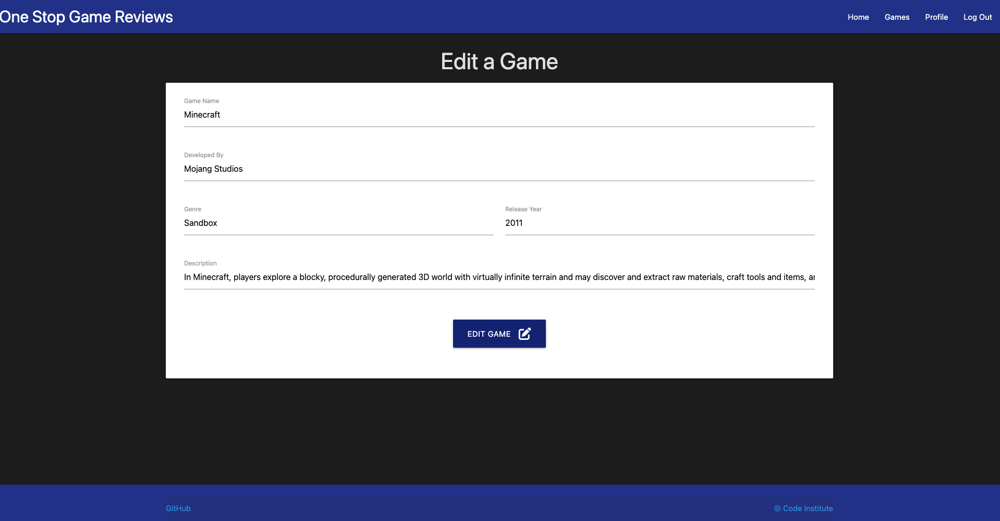

# Testing

To return to the readme click [here.](README.md)

## Code validation

### HTML validation

* Validation for the HTML can be found [here.](https://validator.w3.org/nu/?doc=https%3A%2F%2Fvideo-game-review-ms3.herokuapp.com%2F)

### CSS validation

* Validation for the CSS can be found [here.](https://jigsaw.w3.org/css-validator/validator?uri=https%3A%2F%2Fvideo-game-review-ms3.herokuapp.com%2F&profile=css3svg&usermedium=all&warning=1&vextwarning=&lang=en)

    - Note: Any errors/warnings that are shown is to do with Materialize. If the CSS code is entered via direct input, there will be no errors, as show below.

    

### JS validation

* Validation for the JS can be found [here.](https://jshint.com/)

### Python Validation

* Validation for the Python can be found [here.](http://pep8online.com/)

    - routes.py

    

    - models.py

    

    - init.py

    

    - run.py

    

## Responsiveness

* The following images will showcase how the project is shown on different devices and shows the responsiveness of the project.

    - Mobile devices:

    

    - Tablet devices:

    

    - Desktop devices:

    

## Browser Compatibility

* The following images shows the project being tested in both Chrome and Safari browsers.

    - Chrome

    

    - Safari

    

## User story testing

* I want to understand the context of the website.

-

* I want to be able to register an account with the website to keep track of the reviews I have posted.

* I want to easily log into my already registered account.

* I want to easily log out of the account I am logged into, and be notified that I have successfully been logged out.

    - Once the user has successfully logged out, a message pops up, notifying the user they have logged out successfully.

    

* I would like to access the site easily on a mobile phone or tablet.

    - Mobile:

    

    - Tablet:

    

* I want to be able to check if there are any additional games that have been added.

* I would like to be able to edit the reviews I have created.

* I would like to be able to delete the reviews I have created.
* I would like the ability to delete any review for any reason deemed neccessary.
* I would like defensive programming to be in effect if I was to attempt to delete a review.
* I would like defensive programming to be in effect if I was to attempt to delete a game.
* I would want the deletion of a game to delete any reviews that is associated with said game.

    - Modals will be triggered if either a review or a game is attempted to be deleted by a user/admin.

    

    

* I would like the privilage of only the author and of the review to be able to edit their own review.

    - The image below is the view from user 'johndoe's account, note the edit and delete buttons are only avaliable for the review user has created:

    

    - The image below is the view from an admins account, note that because the current session user is the admin, all edit and delte buttons are present on each review:

    

* I would like to add and manage games that users are able to create a review for.

    - Add games:

    

    - Edit games:

    

* I would like to be able to visually be able to see what users have rated the games, using star icons.

    - Take not of the individual reviews star ratings above their review title.

    

## Environment testing

* The following images are within two seperate environments, they have different URLs to validate this.

### Local environment

* The images below show the game within the local (development) environment of gitpod.

### Production environment

* The images below show the game within the production (deployed) environment of Heroku.

## Bugs

### Unfixed bugs

* There are no unfixed bugs that I am currently aware of.