# Testing

To return to the readme click [here.](README.md)

## Code validation

### HTML validation

- Validation for the HTML can be found [here.](https://validator.w3.org/nu/?doc=https%3A%2F%2Fvideo-game-review-ms3.herokuapp.com%2F)

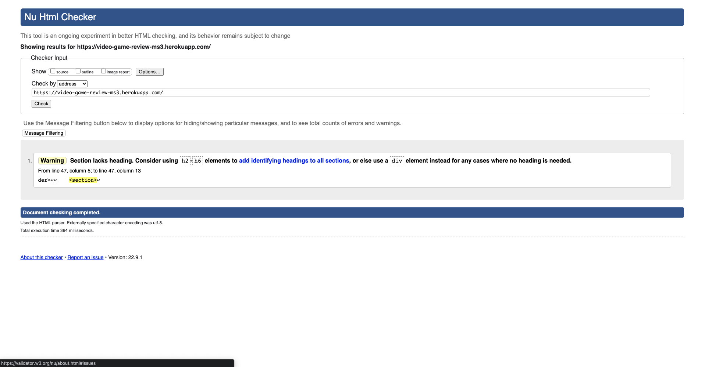

### CSS validation

- Validation for the CSS can be found [here.](https://jigsaw.w3.org/css-validator/validator?uri=https%3A%2F%2Fvideo-game-review-ms3.herokuapp.com%2F&profile=css3svg&usermedium=all&warning=1&vextwarning=&lang=en)

- Note: Any errors/warnings that are shown is to do with Materialize. If the CSS code is entered via direct input, there will be no errors, as show below.

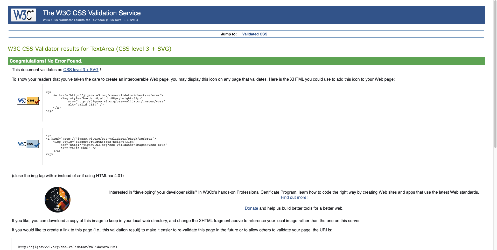

### JS validation

- Validation for the JS can be found [here.](https://jshint.com/)

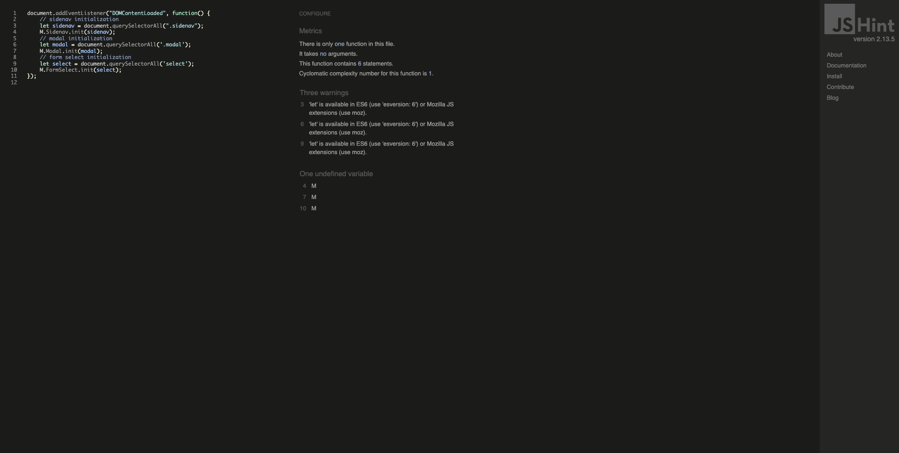

### Python Validation

- Validation for the Python can be found [here.](http://pep8online.com/)

* routes.py

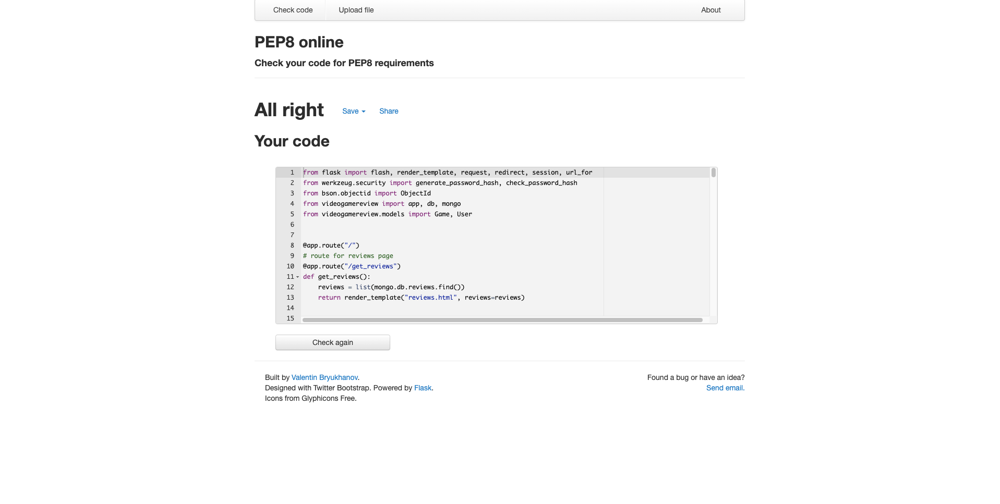

* models.py

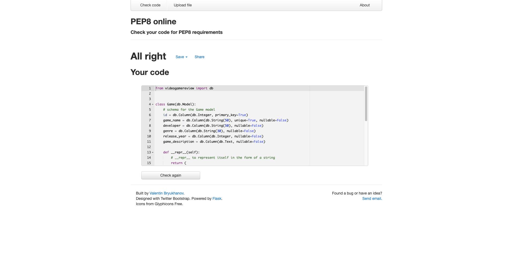

* init.py

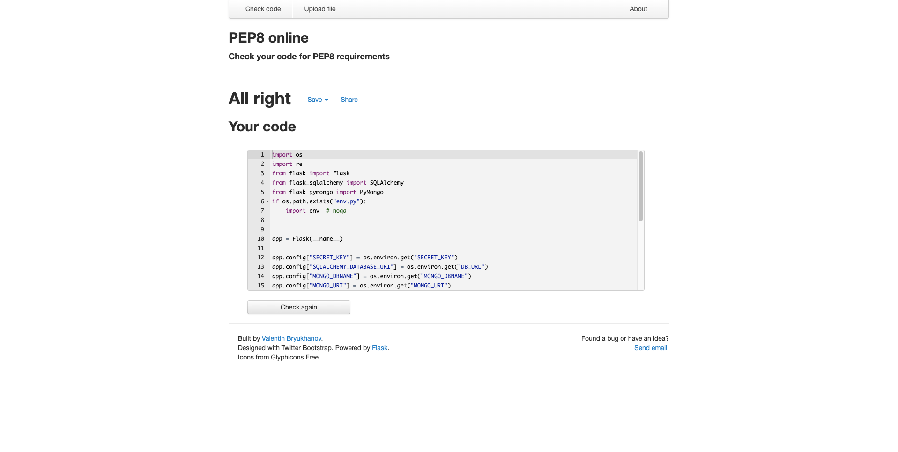

* run.py

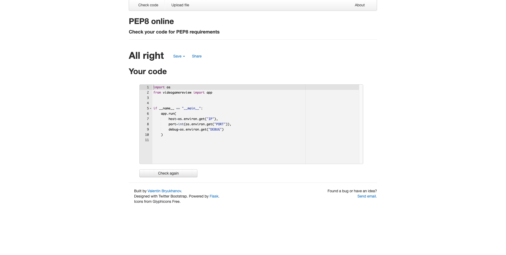

## Responsiveness

* The following images will showcase how the project is shown on different devices and shows the responsiveness of the project.

- Mobile devices

- Tablet devices

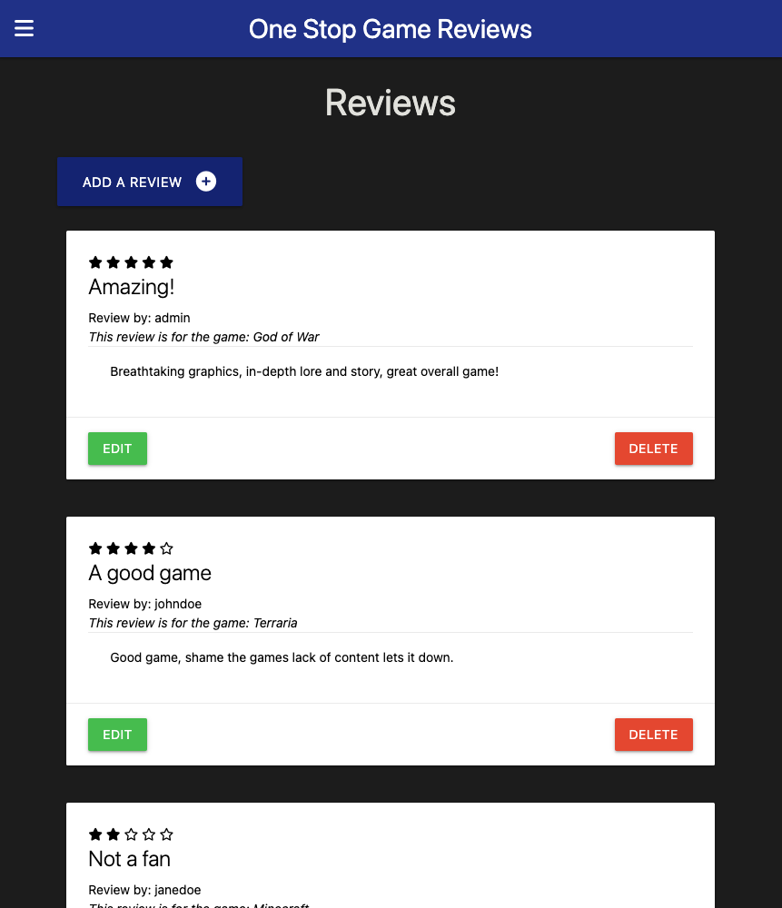

- Desktop devices

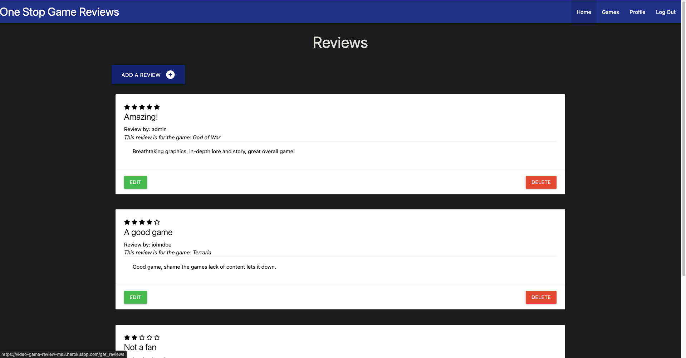

## Browser Compatibility

* The following images shows the project being tested in both Chrome and Safari browsers.

- Chrome

    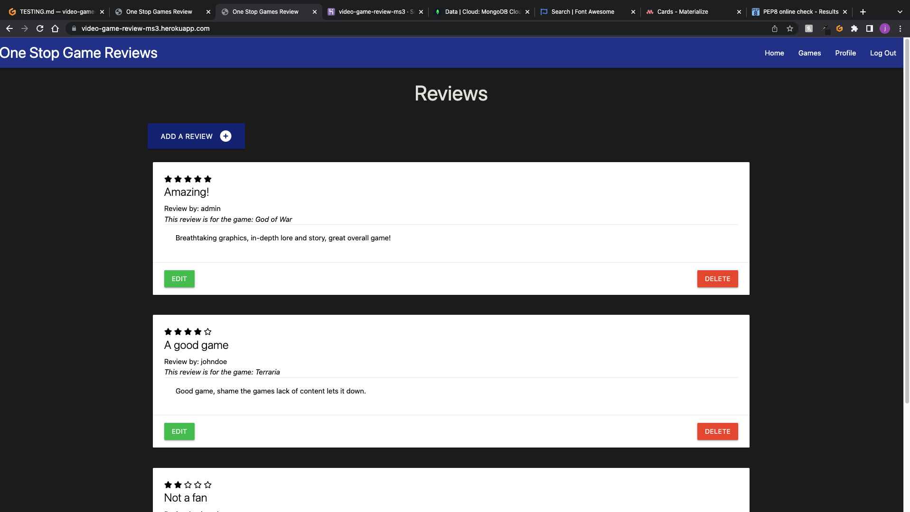

- Safari

    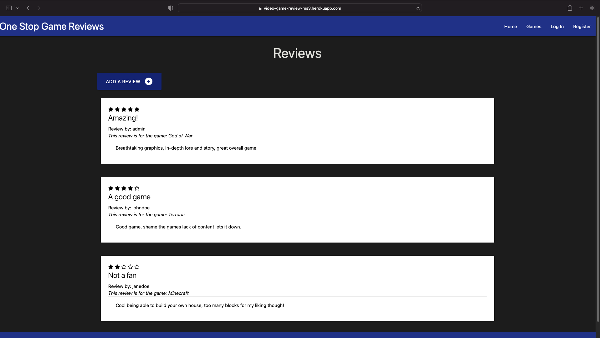

## User story testing

## Environment testing

* The following images are within two seperate environments, they have different URLs to validate this.

### Local environment

* The images below show the game within the local (development) environment of gitpod.

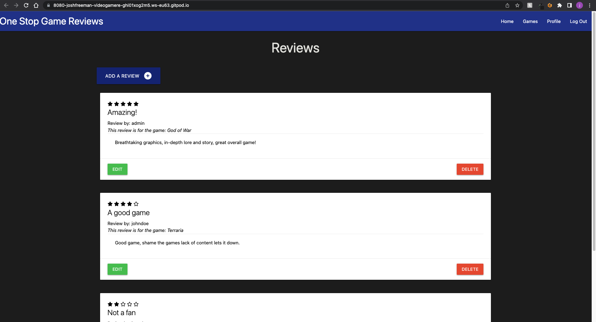

### Production environment

* The images below show the game within the production (deployed) environment of Heroku.

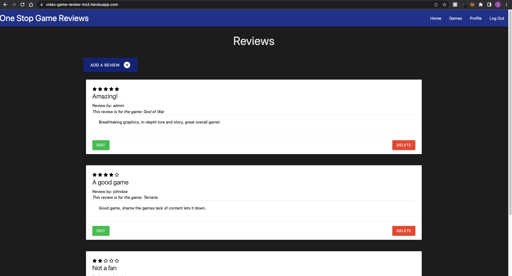

## Bugs

### Unfixed bugs

* There are no unfixed bugs that I am currently aware of.